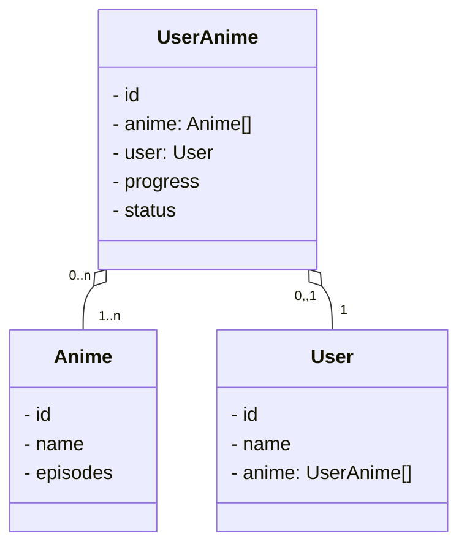

# API REST com Java e Spring Boot

Este projeto foi desenvolvido para o bootcamp da Santander e DIO de 2024. O objetivo é praticar o uso do Spring Framework com o Java. Para isso, foi desenvolvida uma API REST para uma lista de animes.
É possível criar usuários e adicionar animes novos ao banco de dados. Além disso, os usuários cadastrados podem manter controle de seus animes adicionando-os à sua conta e atualizando conforme o necessário o número de episódios assistidos e o status (assistindo, completo, pausado, etc).

### Diagrama de classes do domínio

